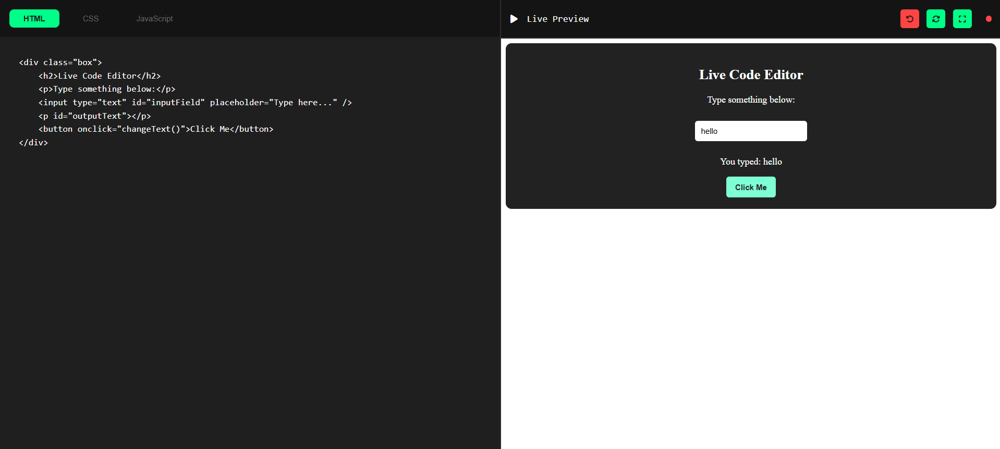

# Code Editor
This Live Code Editor is a real-time coding playground where users can write HTML, CSS, and JavaScript and instantly see the output. It provides a seamless and interactive environment for web development, making it easier to experiment, learn, and debug code.

  
*A modern live-coding environment for web development*

## Features

### Visual Editing
- **Triple-panel interface** (HTML/CSS/JS)
- **Real-time preview** updates as you type
- **Syntax-aware highlighting** (colors tags, properties, and functions)

### Interactive Controls
| Button | Icon | Action |
|--------|------|--------|
| Refresh | 🔄 | Force preview update |
| Reset | ↻ | Clear all code (with confirmation) |
| Fullscreen | ⛶ | Maximize preview panel |

## Quick Start
1. Open `index.html` in any browser
2. Start typing code - see changes instantly!
3. Use the control buttons when needed

## How to Contribute
We welcome design and feature improvements!  
**Suggested enhancements**:
- Add syntax error highlighting
- Implement code autocomplete
- Create export as ZIP functionality

*To contribute*:  
1. Fork the repository  
2. Make your changes  
3. Submit a pull request with screenshots

---
**Transform thoughts into code, code into reality! 🌍💻**